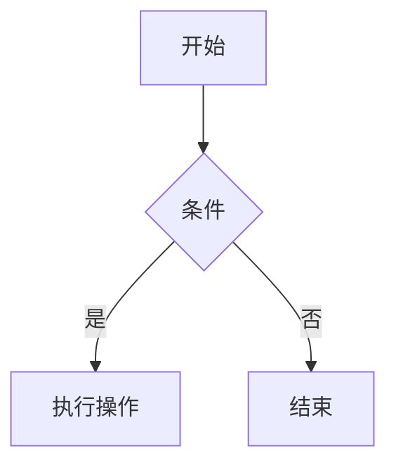
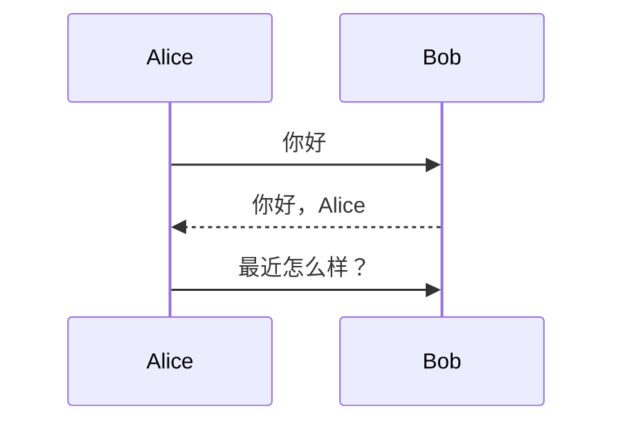

# Markdown 核心语法示例

## 1. 标题

# 一级标题
## 二级标题
### 三级标题
#### 四级标题
##### 五级标题
###### 六级标题

## 2. 文本格式

**粗体文本**
*斜体文本*
***粗斜体文本***
~~删除线文本~~
==高亮文本==
^上标^ (需要插件支持)
~下标~ (需要插件支持)

## 3. 列表

### 无序列表
- 项目1
- 项目2
  - 子项目2.1
  - 子项目2.2
    - 子项目2.2.1

### 有序列表
1. 第一项
2. 第二项
   1. 子项2.1
   2. 子项2.2
3. 第三项

### 任务列表
- [x] 已完成任务
- [ ] 未完成任务
- [ ] 另一个未完成任务

## 4. 引用

> 这是一个引用块

> 嵌套引用
> > 这是嵌套的引用
> > > 更深层的嵌套

## 5. 代码

### 行内代码
使用 `console.log()` 输出信息

### 代码块
```javascript
function hello() {
  console.log("Hello, World!");
}
```

```python
print("Hello, World!")
```

```html
<div class="example">
  <p>这是HTML代码示例</p>
</div>
```

### 代码块带行号
(需要插件支持)
```javascript
1: function add(a, b) {
2:   return a + b;
3: }
4:
5: console.log(add(2, 3)); // 输出 5
```

## 6. 链接

### 行内链接
[Quartz官网](https://quartz.jzhao.xyz/)

### 参考链接
[Quartz][quartz-url]

[quartz-url]: https://quartz.jzhao.xyz/ "Quartz官网"

### 自动链接
<https://quartz.jzhao.xyz/>

### 内部链接
[首页](../index.md)

## 7. 图片

### 行内图片


### 参考图片
![Quartz Logo][quartz-logo]

[quartz-logo]: ../../quartz/static/icon.png "Quartz Logo"

### 图片链接
[](https://quartz.jzhao.xyz/)

## 8. 表格

| 列标题1 | 列标题2 | 列标题3 |
|---------|---------|---------|
| 单元格1 | 单元格2 | 单元格3 |
| 单元格4 | 单元格5 | 单元格6 |
| 单元格7 | 单元格8 | 单元格9 |

### 对齐表格

| 左对齐 | 居中对齐 | 右对齐 |
|:-------|:--------:|-------:|
| 文本1  |   文本2   |  文本3  |
| 文本4  |   文本5   |  文本6  |

## 9. 分隔线

---

***

___

## 10. 脚注

这是一个带有脚注的句子[^1]。

[^1]: 这是脚注的内容。

## 11. 数学公式

### 行内公式
E = mc^2

### 块级公式
$$
\int_{0}^{\frac{\pi}{2}} x \sin x \, dx = ?
$$

$$
\sum_{n=1}^{\infty} \frac{1}{n^2} = \frac{\pi^2}{6}
$$

## 12. 图表

### Mermaid 流程图


### Mermaid 序列图


## 13. 特殊字符

\* 这不是斜体 \* 
\_ 这不是下划线 \_ 
\# 这不是标题 \# 
\> 这不是引用 \> 
\` 这不是行内代码 \`

## 14. 嵌入内容

### 嵌入 YouTube 视频
(需要插件支持)

```html
<iframe width="560" height="315" src="https://www.youtube.com/embed/dQw4w9WgXcQ" title="YouTube video player" frameborder="0" allow="accelerometer; autoplay; clipboard-write; encrypted-media; gyroscope; picture-in-picture; web-share" referrerpolicy="strict-origin-when-cross-origin" allowfullscreen></iframe>
```

## 15. 自定义容器

> [!NOTE]
> 这是一个笔记容器

> [!TIP]
> 这是一个提示容器

> [!IMPORTANT]
> 这是一个重要容器

> [!WARNING]
> 这是一个警告容器

> [!CAUTION]
> 这是一个注意容器
